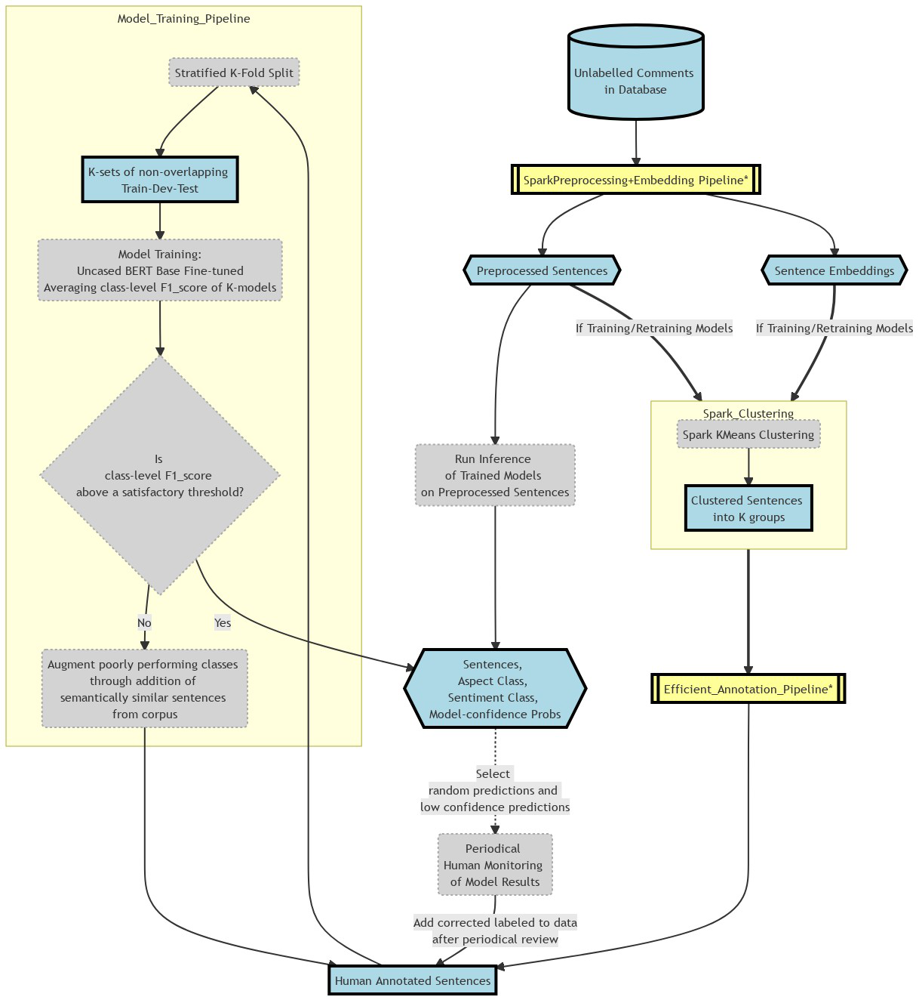
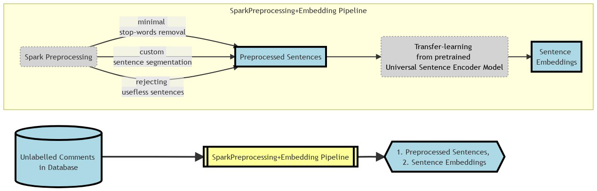
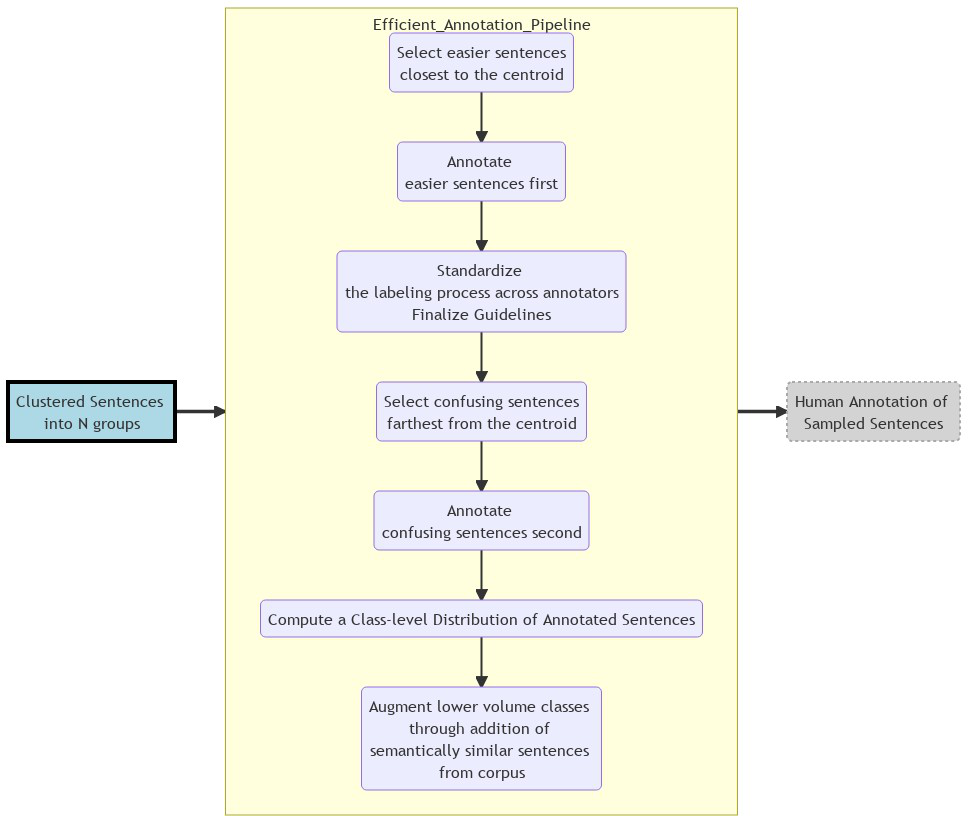
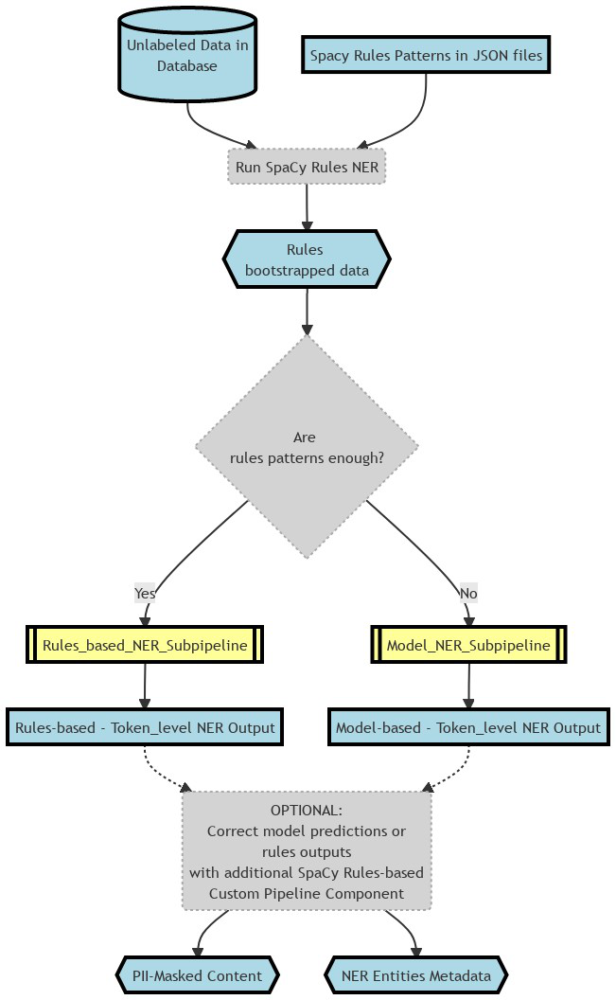
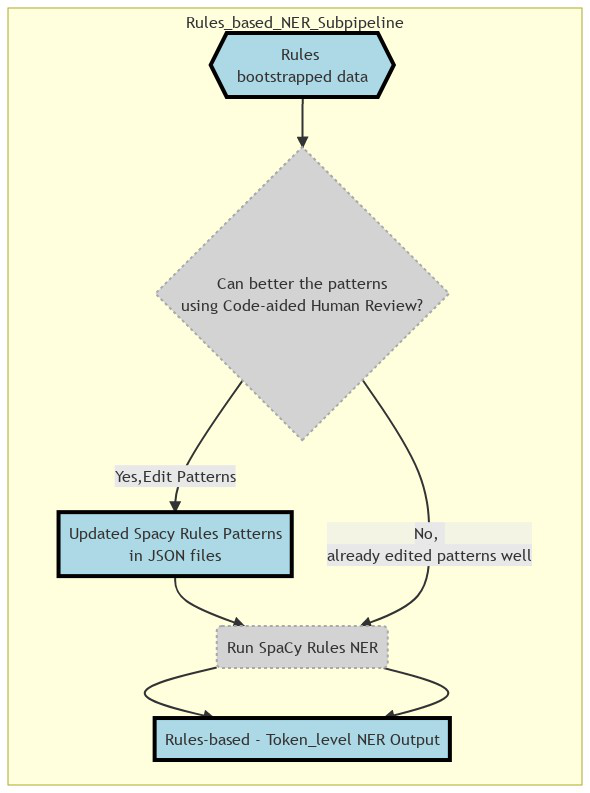
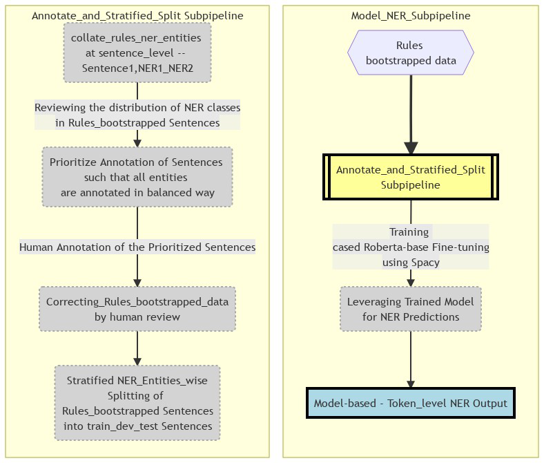

## Some of my NLP Projects

### Project #1: Aspect-based Sentiment Analysis

<blockquote>
 

<b>Project Summary</b>

 
   
  
 - Built a reusable **Sequence Text Classification ML Pipeline**
     - which used BERT-fine-tuning 
     - where free-flowing text was converted into **(Aspect, Sentiment)** pairs
     - where the # of Aspect labels are typically more than 25
     - which had easy to use human-in-the-loop annotation scripts that can 
         - do efficient clustering of yet-to-be labeled data and
         - augment low volume classes after initial round of annotations
     - which yeilded 90%+ F1 score with minimal annotated data 
     - which had scripts to monitor performance of model 

- Built a comprehensive Docker Image that hosted the DL models as well as Spark
  

 

<b>I/P and O/P</b>

 
- **Example I/P**:
     > "The representative  who initially spoke with was very understanding but the dealer whom I was transferred to later was rude and unhelpful"
- **Example O/P**:  
  Part 1:  
     > "The representative who initially spoke with was very understanding"  
     > `Contact_Center_Agent` | `Positive`  
 
  Part 2:  
     > "but the dealer whom I was transferred to later was rude and unhelpful"  
     > `Dealer` | `Negative`

  

<b>Business/Technical Benefits</b>

- The codebase was used to build *30+ different Text Classification Models*
    - using the same ML pipeline/framework where each model had 20-30 classes to predict 
- Our repo's framework and models warranted far less human annotated data (than using a typical ML model)
- This was possible because both **Feature Extraction** :snowflake: (for clustering) and **Fine-tuning** :fire: (for BERT Fine-tuning was used

 

<b>Technology Stack</b>

 
  
 
         
 
 
 
 

	 
 <b>Detailed Pipeline </b> 

	 
  
	 
 
	 
  

*Text2Embedding Sub-pipeline

 
  

  

  

*Efficient Annotation Sub-pipeline

 
  
 
  

 
 </blockquote>

### Project #2: Personally Identifiable Information (PII) Detection using NER

<blockquote>
 

<b>Project Summary</b>

 
   
  
- To replace PII in text data
    - by building a **Named Entity Recognition (NER)** system that can detect PII in text comments
- Built a Rules-based NER to bootstrap Training data
  

 

<b>I/P and O/P</b>

 
- **Example I/P**:
     > "Please drop my 2019 Focus after service to 2109 Hershell Hollow Road, Nashville, Tennesse. You can reach me at +1 854-789-1234 or gary_kirsten1978@gmail.com - Gary Kirsten" ( a made-up example)
- **Example O/P**:  
 
     > Please drop my `{{MODEL_YEAR}}` `{{NAMEPLATE}}` after service to `{{ADDRESS}}`. You can reach me at `{{PHONE_NUMBER}}` or `{{EMAIL}}` - `{{PERSON_NAME}}`
 

  

<b>Business/Technical Benefits</b>

- PII Annonymization can aid in less restricted use of the data
- Spacy's Roberta-base Model circumvented the truncation restriction of the transformers max sequence length problem. Refer [Link](https://spacy.io/api/transformer#span_getters)

 

<b>Technology Stack</b>

 
  
 
      
 
 
 
 
 

	 
 <b>Detailed Pipeline </b> 

	 
  
	 
 
	 
  

*Rules-based NER Sub-pipeline

 
  

  

  

*Model-based NER Sub-pipeline

 
  
	  
  

 </blockquote>

### Project #3: Unsupervised Text Data Clustering Pipeline

<blockquote>
 

<b>Project Summary</b>

 
   
  
- To build reusable Text Clustering pipelines  
    - with simpler Python APIs runnable inside docker images that can be used by non-NLP analysts 
    - to derive actionable insights from unlabeled text corpus using unsupervised clustering techniques
- The codebase was built on top of the main open source libraries 
    - PyTorch (Transformers, Sentence Transformers), Sklearn
  

 

<b>Methodology Workflow</b>

- Can Transfer Learning (TL) based pre-trained Sentence Models work for your data?
    - (1) If `Yes`
        - Employ TL-based Embedding & Hard Clustering
        - E.g.: Customer comments, corpora like Wiki,Brown Corpus, Web Forum discussions   
    - (2) If `No` (it is a domain-specific data)
        - Employ the best of Traditional Embedding and Topic Modeling
        - E.g.: Technician logs, domain-specific survey
 
**Methodology 1**:  
- *TL-based Embedding & Hard Clustering*
    - Embedding options: Employ any good Sentence Embedding technique
        - SentenceBERT (`sentence transformers` library)
        - Universal Sentence Coder (via TFHub)
- Indexing: Approx. Nearest Neighbours (ANNoy) on top of Embedding
- Clustering options: KMeans OR HDBSCAN
 
**Methodology 2**:  
- *Traditional Embedding and Topic Modeling*
    - Simple-but-Effective (arguable) Traditional Embedding Used:
        - Custom Vectorizer Pipeline
            - Spacy-tokenized
            - Lemmatized
            - TF-IDF Vectorizor
    - Topic Modeling Variant Options:
        - Simple LDA
        - Semi-supervised or Guided or Seeded LDA
    - pyLDAvis Visualization
        - Inter-topic Distance Map & Topic Occurence Freq
        - per-Topic Word Distribution
 

 

<b>Technology Stack</b>

 
  
 
        
 
 
 
 
 </blockquote>
 
 
### Project #4: A Unsupervised + Supervised NLP Semantic Search Pipeline
(inspired by the workings of a NLP QA system but for Semantic Search) 
 
### Project #5: Social Media Data Analysis
  
### Project #6: Multi-GPU Neural Machine Translation (NMT) Inference Pipeline

### Project #7: Analysis of Speech2Text Models
(Comparison of Results of Paid Speech2Text APIs and Open-source DeepSpeech Pre-trained Models)
