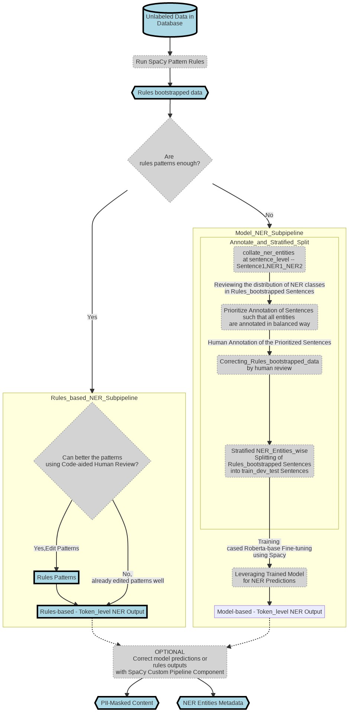

<h1 align='center'>
  Hi there 👋 I'm Senthil Kumar 👨‍💻
</h1>

  I am an Applied Data Scientist working on Natural Language Processing (NLP) focused Analytics Projects.

  You can reach me via

  &nbsp;&nbsp;
  &nbsp;&nbsp;

## :man_in_tuxedo: I am ...

   - a **Specialist in NLP** who has ...
       - extensively applied NLP techniques for text data 
       - decent mathematical knowledge on the fundamentals of Statistics/Probability, ML/DL and NLP
   - a Generalist who builds **Python-based Data Science applications/solutions** which ...
       - use Sklearn in case of ML models and PyTorch ecosystem for DL
       - use Pandas, Altair, Jupyter and Streamlit for Data Explorations and Visualization

## :hammer_and_wrench: I typically build ...

   - NLP applications with ...
       - state-of-the-art **transfer learning models** (Feature Extraction and Fine-tuning)
       - customized text preprocessing logic using computational linguistic techniques wherever it helps!
       - deployed using Python CLI apps, **FastAPI REST APIs** or **Streamlit UIs** in Kubernetes
   - codebase ...
       - which is reusable, replicable and runnable in **docker containers**
       - which is modularized and packaged (as `from some_internal_package import what_you_need`)
       - committed to **GitHub** for co-development and issue-resolution
       - with docstrings and pytests, subjected to **Pull Requests** when multiple developers are involved

## :computer: While coding, I typically use tools such as ...

   - **WSL** for local development, and linux machines for GPU-powered, dockerized applications development
   - predominantly **PyCharm (Professional)** for remote development but use opensource **VS code** for local development
   - **Jupyter Notebook** to learn coding concepts 
   - **draw.io**, **mermaid** and **markdown** for flowcharts and documentation purposes

## 📅 🎙️: While not coding, I typically use tools such as ...

   - **OneNote** for taking lots of notes from emails, meetings and websites and  
   - **Slack** for communicating, weekly updates and jotting down reminder messages to self
   - **Microsoft PPT** for conveying data stories/insights to non-developer team mates or superiors

## :bearded_person: Apart from being `a Data Science Developer`, I have donned the hat of ...

   - A `People Manager` 
       - directly managing the delivery of Social Media Analytics projects of 8+ members in my stint at `LatentView Analytics` 
   - A `Technical Mentor/Trainer`
       - enhancing the NLP/Python expertise of fellow team members or reportees 

## :chart_with_upwards_trend: My Career Graph ...

<blockquote>
	
    

 
 <b>Current Role</b> 

 
	
   - Since May'18, I have been working in data science `NLP projects` at <i><b>Ford Analytics Division</i></b>   
   - Worked for teams such as Artificial Intelligence Advancement Center, Customer Experience and Operations Analytics

 
 <b>Previous Roles</b> 

 
	
   - For 4 years, I had offered `Social Media Analytics` and Text Analysis solutions to a F100 Tech client of <i><b>LatentView Analytics</b></i>  
   - In the first 4 years of my career, I had worked in Market Research domain. 

 
 <b>Work Experience Summary</b> 

 

   - Total Experience: 11+ Years | 2010 - Present  
   - NLP Experience: 7+ Years | 2014 - Present  
   - Market Research Experience: 4 Years | 2010 - 2014  

	
	| Company            | Designation                               | Timeline         |
	|--------------------|-------------------------------------------|------------------|
	| Ford Motor Company | Deputy Manager                            | Nov'19 - Present |
	|                    | Senior Analyst                            | May'18 - Oct'19  |
	| LatentView         | Assistant Manager                         | Oct'16 - Apr'18  |
	|                    | Senior Analyst                            | Apr'14 - Sep'16  |
	| CapGemini          | Senior Consultant                         | Jan'14 - Mar'14  |
	| Beroe              | Analyst Senior Analyst Lead Analyst | Jul'10 - Dec'13  |
	

 
 <b>Key Technical Skills</b> 

 
	
- Python | NLP via Rules, Linguistics and ML Techniques | Deep Learning for NLP | ML Projects Execution

	|                  | `Extensively Used`                                                                                                                                                                                                                                                                                                                                                                                                                                                                                                                                                                                 | `Working Knowledge`                                                                                                                                                                                                                                                                                                                                                                                                                                |
	|------------------|----------------------------------------------------------------------------------------------------------------------------------------------------------------------------------------------------------------------------------------------------------------------------------------------------------------------------------------------------------------------------------------------------------------------------------------------------------------------------------------------------------------------------------------------------------------------------------------------------|----------------------------------------------------------------------------------------------------------------------------------------------------------------------------------------------------------------------------------------------------------------------------------------------------------------------------------------------------------------------------------------------------------------------------------------------------|
	| Tools             |            |                                                                                                                      |
	| Python Libraries |                                                                        |        |

	
</blockquote>
	

## :man_student: My Educational Background ...

<blockquote>

 
 <b>Academic Background</b> 

 
	
   - B.E. Madras Institute of Technology, **8.6** CGPA | 2006 - 2010
   - **State topper** in State-level Eng. Entrance Exam | 2006
   - Twelfth Grade - 95% | 2006 ; Tenth Grade - 92% | 2004

	

 
 <b>Course Work</b> 

  

- `Google Cloud Platform Big Data and Machine Learning Fundamentals`| **Coursera-GCP** | Apr 2021  
- 5 course `DeepLearning` Specialization | **Coursera-Deeplearning.ai** | Nov'18 - May'19  
- Applied ML and Applied Text Mining Courses | **Coursera-University of Michigan** | Dec'17 - Jan'18  
- Stanford Online Certification Course on SQL | **Stanford University Online** | 2015
	

	
</blockquote>

## :office_worker: A sample list of my key recent projects ... 

##### Project #1: Aspect-based Sentiment Analysis
	
<blockquote>
 

	 
 <b>Quick Overview </b> 

  
	 
|     Item                 |     Description                                                                                                                                                                                                                                           |
|--------------------------|-----------------------------------------------------------------------------------------------------------------------------------------------------------------------------------------------------------------------------------------------------------|
|     **Project Objective**    |                To build reusable **Sequence Text Classification ML Pipeline**  To convert Text --> **(Aspect, Sentiment)** pairs                                                                                                              |
|      **Example I/P** (a madeup example)         |     (**comment_id**, **comment**)  ⬇️ ⬇️ ⬇️   (23, "The representative   who initially spoke with was very understanding but the dealer whom I was   transferred to later was rude and unhelpful. We were happy to have got a free   car wash however the service for just an oil change is too long.")     | 
|      **Example O/P**         |     (**comment_id**, **sentence_start**, **sentence_end**, **sentence**, **Predicted_Aspect**, **Predicted_Sentiment**)  ⬇️ ⬇️ ⬇️   (23,0,W, "The representative who initially spoke with was very understanding",`Contact_Center_Agent`,`Positive`)  (23,W+1,X,"but the dealer whom I was transferred to later was rude and unhelpful",`Dealer`,`Negative`)  (23,X+1,Y,"We were happy to have got a free car wash",`Car Wash`,`Positive`)  (23,Y+1,Z,"however the service for just an oil change is too long.",`Service_Timeliness`,`Negative`)  Legend: W, X, Y, and Z referring to token character indices | 
|     **Business/Technical  Benefits**   |    <ul><li>Our repo and its codes were used to build *30+ different Text Classification Models*  using the same ML pipeline/framework where each model had 20-30 classes to predict</li><li>Our repo's framework and models warranted far less human annotated data (than using a typical ML model)</li></ul>|	
|     **Key Tools & Libraries**    |                                                                                                                                      |
	
 

 

	 
 <b>Detailed Pipeline </b> 

	 
  
	 
 
	 
  

*Text2Embedding Sub-pipeline

 
  

  

  

*Efficient Annotation Sub-pipeline

 
  
 
  

  
 

</blockquote>
	
##### Project #2: Personally Identifiable Information (PII) Detection using NER
	
<blockquote>
 

	 
 <b>Quick Overview </b> 

  
	 
|     Item                 |     Description                                                                                                                                                                                                                                           |
|--------------------------|-----------------------------------------------------------------------------------------------------------------------------------------------------------------------------------------------------------------------------------------------------------|
|     **Project Objective**   |       - To replace PII in text data  - To build a Named Entity Recognition (NER) system that can detect PII in text comments |
|      **Example I/P**  (a madeup example)       |   Please drop my 2019 Focus after service to 2109 Hershell Hollow Road, Nashville, Tennesse. You can reach me at +1 854-789-1234 or gary_kirsten1978@gmail.com - Gary Kirsten  | 
|      **Example O/P**         |  Please drop my `{{MODEL_YEAR}}` `{{NAMEPLATE}}` after service to `{{ADDRESS}}`. You can reach me at `{{PHONE_NUMBER}}` or `{{EMAIL}}` - `{{PERSON_NAME}}`    | 
|     **Business/Technical  Benefits**    |   <ul><li>PII Annonymization can aid in less restricted use of the data</li><li>Spacy's Roberta-base Model circumvented the truncation restriction of the transformers max sequence length problem. Refer [Link](https://spacy.io/api/transformer#span_getters)</li></ul>|	
|     **Key Tools & Libraries**    |                                                                                                                                     |
	 
 

 

	 
 <b>Detailed Pipeline </b> 

 	 
 	 
 
 

</blockquote>

##### Project #3: Unsupervised Clustering Pipeline
	
<blockquote>
 

	 
 <b>Quick Overview </b> 

  
	 
|     Item                 |     Description                                                                                                                                                                                                                                           |
|--------------------------|-----------------------------------------------------------------------------------------------------------------------------------------------------------------------------------------------------------------------------------------------------------|
|     **Project Objective**   |  <ul><li>To derive actionable insights faster from unlabeled text corpus using unsupervised clustering techniques</li></ul>   |
|     **Overall Methodology**   |   <li>Is the text corpus ~ corpora like `Wiki`,`Brown Corpus`, `Web Forum discussions`   or such generic test used for pre-training Transfer learning (TL) models?<ul><li>Yes: <b>TL-based Embedding & Hard Clustering</b></li><li>No, it is a <b>domain-specific data</b>  uncommon to find anything similar in open-source datasets  (e.g.: Technician logs, domain-specific survey): Employ the best of Traditional Embedding and Topic Modeling</li></ul></li> |
|     Methodology1: **DL-based Sentence Embedding AND Hard Clustering**    | <ul><li><b>TL-based Embedding & Hard Clustering</b>:<ul><li><b>Embedding</b>: Any Sentence Embedding technique<ul><li>InferSent</li><li>SentenceBERT</li><li>Universal Sentence Coder(used in my proj)</li><li>Any other</li></ul></li><li><b>Search</b>: Approx. Nearest Neighbours (ANNoy) on top of Embedding</li><li><b>Clustering</b>: KMeans OR HDBSCAN</li></ul></li></ul> |
|     Methodology2: **Traditional Embedding AND   Topic Modeling**    | <ul><li><b>Domain-specific Data</b>:<ul><li><b>Simple-but-Effective (arguable) Traditional Embedding Used</b>:<ul><li>Custom Vectorizer Pipeline<ul><li>Spacy-tokenized</li><li>Lemmatized</li><li>TF-IDF Vectorizor</li></ul></li></li></ul><li><b>Topic Modeling Variants We Used:</b><ul><li>Simple LDA</li><li>Semi-supervised or Guided or Seeded LDA</li></ul></li><li><b>pyLDAvis Visualization</b><ul><li>Inter-topic Distance Map & Topic Occurence Freq</li><li>per-Topic Word Distribution</li></ul></li></ul></li></ul> |
|     **Key Tools & Libraries**    |                                                                                                                                    |

</blockquote>

## 👨‍💻 ssh `SenthilKumar@WannaKnowMore` 

 👨‍💻 <b>SenthilKumar@WannaKnowMore:~WhoAmI$</b> <code>cat MyProfessionalStory.txt</code> :person_in_tuxedo: 

<blockquote>
  

 
How did I start my career?  

 
  
- Back in July 2010, I had started out providing customized Market Research (MR) in my first 4 years of my career. 
  - Simply put, it was a `no-code work` 
       - involving cold-calling, speaking to experts and reading a lot of secondary research material 
       - to write actionable procurement intelligence reports . 
  - This first job, right after my engineering undergraduation, 
       - had taught me the importance of tough-to-learn soft skills 
       - especially in communication be it written, one-on-one, cold-calling, team presentations and many more. 

 
When did I transition to NLP?  

 
  
- Since 2014, I have been in the field of Data Science, and the romance has not died down yet :). 
- Largely because of the interesting NLP opportunities that landed my way.  
- I had primarily worked on `Social Media Analytics` at `LatentView` from 2014 to 2018 where   
    - I had aided my F100 tech major client to effectively use social media insights in their marketing decisions
- Since May 2018, as a Data Scientist at Ford,
    - my technical learnings in ML/DL and NLP have been on an upward trend! 

    

 
 What are my mottos?  

 
  
  Striving to follow the below mottos for professional betterment:   
  - To keep **upskilling my technical knowledge** 
      - Firmly believe there are **Miles to go before I sleep**   
  - To bring **the best collaborative, transparent and importantly humble self in my interactions** with colleagues/friends, 
      - This is so that trust is enabled, long-term partnerships are forged and great results are achieved  
   - To **stand on the shoulders of the giants of open source** 
      - In other words, be **applied practitioner** first, and not try to reinvent the wheel unless it has some learning/business benefit 
  

</blockquote>

 👨‍💻 <b>SenthilKumar@WannaKnowMore:~WhoAmI$</b> <code>cat MyPersonalStory.txt</code> :family_man_woman_boy: 

<blockquote>

 
 My Small World  

 
  
  
  - I am here working happily in the Data Science field largely because of the sacrifice & guidance of my `wife` . 
      - She guided my transition from Market Research to Data Science. She is a fellow analytics professional too  
      - She is on a break to take care of our possibly autistic todler son.  
      - I am cognizant of this privilege that I am enjoying (me being able to work when she couldn't).  
      - It has been particularly exacerbated by covid situation and personal losses  

 - Speaking of my `son`   
      - He is the apple of my eye  
      - He seems to have exemplary memory, well beyond his age! (possibly biased opinion 🙂)   
      - He grasps abstract things like shapes, numbers, letters, and words faster
      - He could be in some autism spectrum (slower learning in social skills compared to kids of his age)  
            - With my wife's leadership we diagnosed it early and  
            - Hopefully we are acting on it early before it becoming too noticeable 
  

 
 My Interests  

   
  
  - For last 2 years, I have spent (okay, wasted!) a lot of time on many must-watch TV series. Some iconic I must say.  
      - My favorite genres: Sci-Fi, Comics, Legal/Medical thrillers and anything out of this world  
  - My favorites among novels include many mythology fictional writings  
  - An ardent tea lover! 

</blockquote>

 👨‍💻 <b>SenthilKumar@WannaKnowMore:~WhoAmI$</b> <code>cat MyPDFResume.txt</code> :scroll: 

<blockquote>
   
- Here is my [résumé](https://github.com/senthilkumarm1901/senthilkumarm1901/blob/main/Senthil_Kumar_Resume.pdf) in pdf  

     
'
</blockquote>

