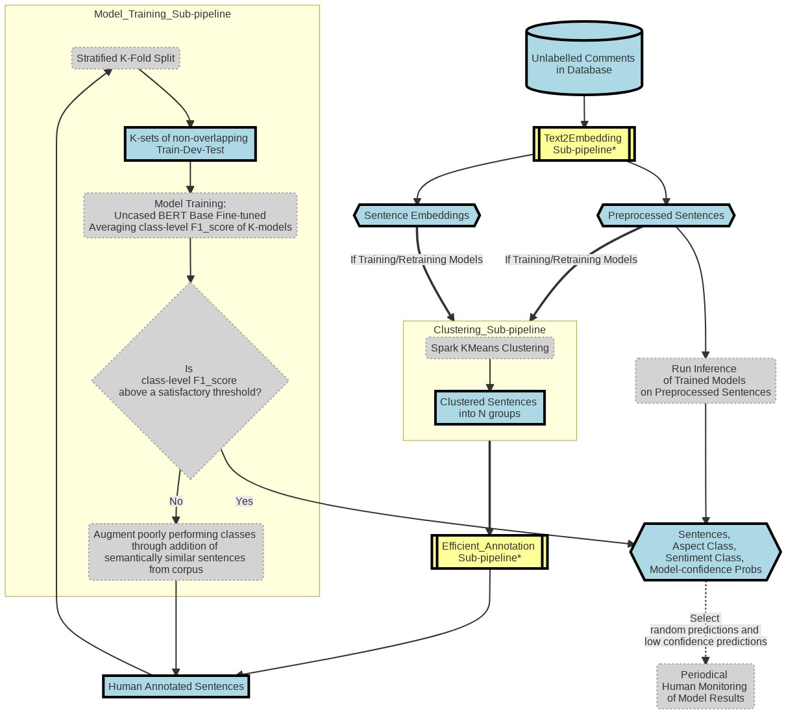
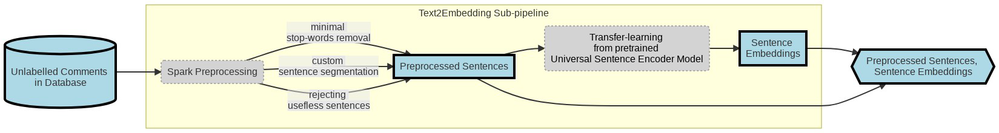
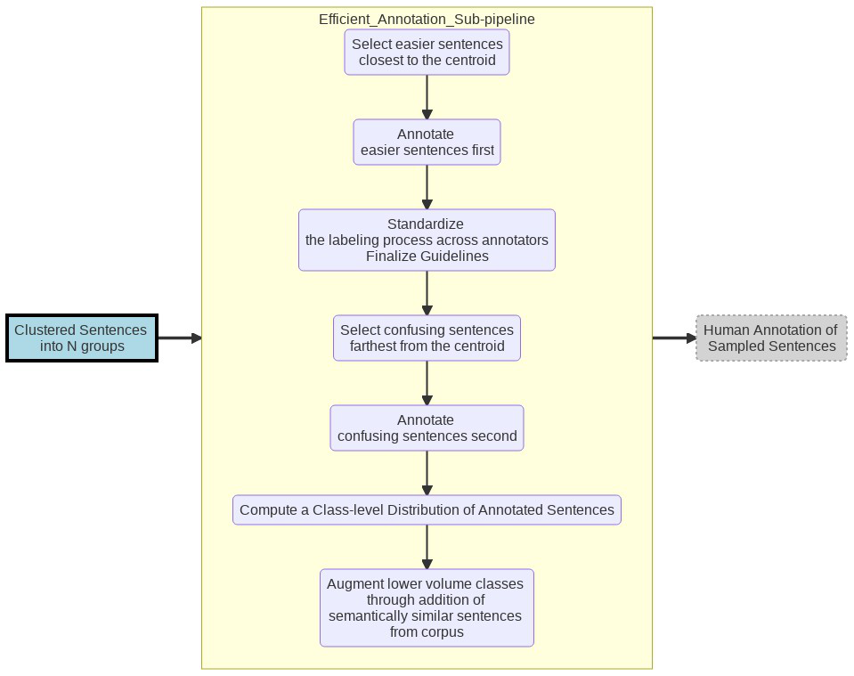
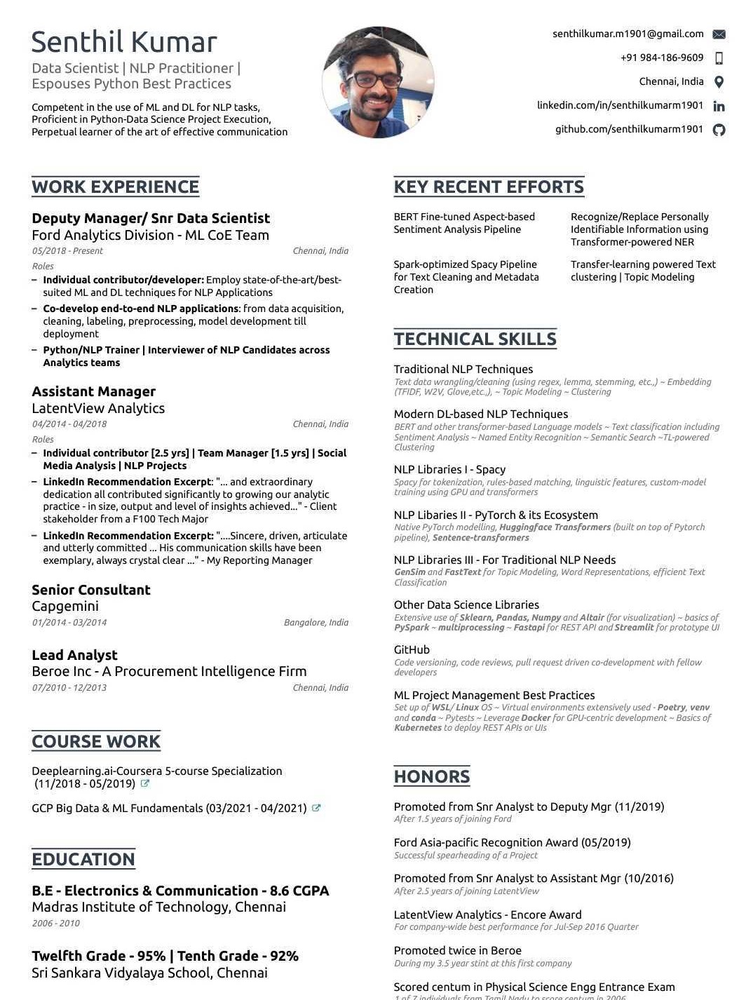

<h1 align='center'>
  Hi there 👋 I'm Senthil Kumar 👨‍💻
</h1>

  A Data Scientist from Chennai, India working on Natural Language Processing Projects.

  Reach me below 

  &nbsp;&nbsp;
  &nbsp;&nbsp;

- I have `extensively used` tools like  
    
    
    
    
    
    
  
- I have `working knowledge` of following tools for ML Projects execution  
    
    
    
    
    

- I have `extensively used` the following Python libraries for my tasks  
    
    
    
    
    
    

- I have `working knowledge` of the following Python libraries which were used in various project-specific needs  
    
    
    
    
    
    
    

### 👨‍💻 SenthilKumar@Profile:~$ `WhoAmI` --professional_identity --brief_overview
<blockquote>

<code>Work Experience</code> 11+ years | Since 2010  
 
 
- `May '18 - Present`: 
	- I have been working in `data science NLP projects` at <i><b>Ford Analytics Division</b></i> for several teams such as 
		- ML Centre of Excellence, 
		- Customer Experience and 
		- Operations Analytics  
- `Apr'14 - Apr'18`: 
	- For 4 years, I had offered `Social Media Analytics` and Text Analysis solutions   to a F100 Tech client of <i><b>LatentView Analytics</b></i>  
- `Jul'10 - Mar'14`: 
	- In the first 4 years of my career, I had worked in Market Research domain. 
      - I had started out providing customized Market Research (MR) at <i><b>Beroe</b></i> for 3.5 years
      - For a brief 3-month period, worked on providing supporting Market Research to Spend Analytics Reports at <i><b>Capgemini</b></i>  
  
  

  

<code>Academic Background</code>

 
- `2006 - 2010`:
	- Bachelors in Engineering, 
	- <b>Madras Institute of Technology</b>, Chennai, India 
	- 8.6 CGPA  
- `2004 - 2006`: 
	- A state topper in state-level Engg Entrance exam in 2006  
	- Twelfth Grade (2006) - 95% | Tenth Grade (2004) - 92%

 

</blockquote>
 
### 👨‍💻 SenthilKumar@Profile:~$ `WhoAmI` --professional_identity --verbose
<blockquote>
  

 
How did I start my career?  

 
  
- Back in July 2010, I had started out providing customized Market Research (MR) in my first 4 years of my career. 
  - Simply put, it was a `no-code work` 
       - involving cold-calling, speaking to experts and reading a lot of secondary research material 
       - to write actionable procurement intelligence reports . 
  - This first job, right after my engineering undergraduation, 
       - had taught me the importance of tough-to-learn soft skills 
       - especially in communication be it written, one-on-one, cold-calling, team presentations and many more. 

 
When did I transition to NLP?  

 
  
- Since 2014, I have been in the field of Data Science, and the romance has not died down yet :). 
- Largely because of the interesting NLP opportunities that landed my way.  
- I had primarily worked on `Social Media Analytics` at `LatentView` from 2014 to 2018 where   
    - I had aided my F100 tech major client to effectively use social media insights in their marketing decisions
- Since May 2018, as a Data Scientist at Ford,
    - my technical learnings in ML/DL and NLP have been on an upward trend! 

    

 
 What are my mottos?  

 
  
  Striving to follow the below mottos for professional betterment:   
  - To keep **upskilling my technical knowledge** 
      - Firmly believe there are **Miles to go before I sleep**   
  - To bring **the best collaborative, transparent and importantly humble self in my interactions** with colleagues/friends, 
      - This is so that trust is enabled, long-term partnerships are forged and great results are achieved  
   - To **stand on the shoulders of the giants of open source** 
      - In other words, be **applied practitioner** first, and not try to reinvent the wheel unless it has some learning/business benefit 
  

</blockquote>

### 👨‍💻 SenthilKumar@Profile:~$ `MyProjects` --professional 

#### Project #1: <b>Aspect-based Sentiment Analysis
	
<blockquote>
 

	 
 <b>Quick Overview </b> 

  
	 
|     Item                 |     Description                                                                                                                                                                                                                                           |
|--------------------------|-----------------------------------------------------------------------------------------------------------------------------------------------------------------------------------------------------------------------------------------------------------|
|     Project Objective    |                To build reusable **Sequence Text Classification ML Pipeline**  To convert Text --> **(Aspect, Sentiment)** pairs                                                                                                              |
|      Example I/P         |     (**comment_id**, **comment**)  ⬇️ ⬇️ ⬇️   (23, "The representative   who initially spoke with was very understanding but the dealer whom I was   transferred to later was rude and unhelpful. We were happy to have got a free   car wash however the service for just an oil change is too long.")     | 
|      Example O/P         |     (**comment_id**, **sentence_start**, **sentence_end**, **sentence**, **Predicted_Aspect**, **Predicted_Sentiment**)  ⬇️ ⬇️ ⬇️   (23,0,W, "The representative who initially spoke with was very understanding",`Contact_Center_Agent`,`Positive`)  (23,W+1,X,"but the dealer whom I was transferred to later was rude and unhelpful",`Dealer`,`Negative`)  (23,X+1,Y,"We were happy to have got a free car wash",`Car Wash`,`Positive`)  (23,Y+1,Z,"however the service for just an oil change is too long.",`Service_Timeliness`,`Negative`)  Legend: W, X, Y, and Z referring to token character indices | 
|     Key Tools & Libraries    |                                                                                                                                     |	
	
 

 

	 
 <b>Detailed Pipeline </b> 

	 
  
	 
 
	 
  

Text2Embedding Sub-pipeline

 
  

  

  

Efficient Annotation Sub-pipeline

 
  
 
  

  
 

</blockquote>

	
### 👨‍💻 SenthilKumar@Profile:~$ `WhoAmI` --personal_identity --verbose

<blockquote>

 
 My Small World  

 
  
  
  - I am here working happily in the Data Science field largely because of the sacrifice & guidance of my `wife` . 
      - She guided my transition from Market Research to Data Science. She is a fellow analytics professional too  
      - She is on a break to take care of our possibly autistic todler son.  
      - I am cognizant of this privilege that I am enjoying (me being able to work when she couldn't).  
      - It has been particularly exacerbated by covid situation and personal losses  

 - Speaking of my `son`   
      - He is the apple of my eye  
      - He seems to have exemplary memory, well beyond his age! (possibly biased opinion 🙂)   
      - He grasps abstract things like shapes, numbers, letters, and words faster
      - He could be in some autism spectrum (slower learning in social skills compared to kids of his age)  
            - With my wife's leadership we diagnosed it early and  
            - Hopefully we are acting on it early before it becoming too noticeable 
  

 
 My Interests  

   
  
  - For last 2 years, I have spent (okay, wasted!) a lot of time on many must-watch TV series. Some iconic I must say.  
      - My favorite genres: Sci-Fi, Comics, Legal/Medical thrillers and anything out of this world  
  - My recent favorites among novels include many mythology fictional writings.

</blockquote>
	
### 👨‍💻 SenthilKumar@Profile:~$ `WhoAmI`  --download_résumé   

<blockquote>
- Here is my [résumé](https://github.com/senthilkumarm1901/senthilkumarm1901/blob/main/Senthil_Kumar_Resume_21Aug21.pdf) in pdf  

 
</blockquote>
