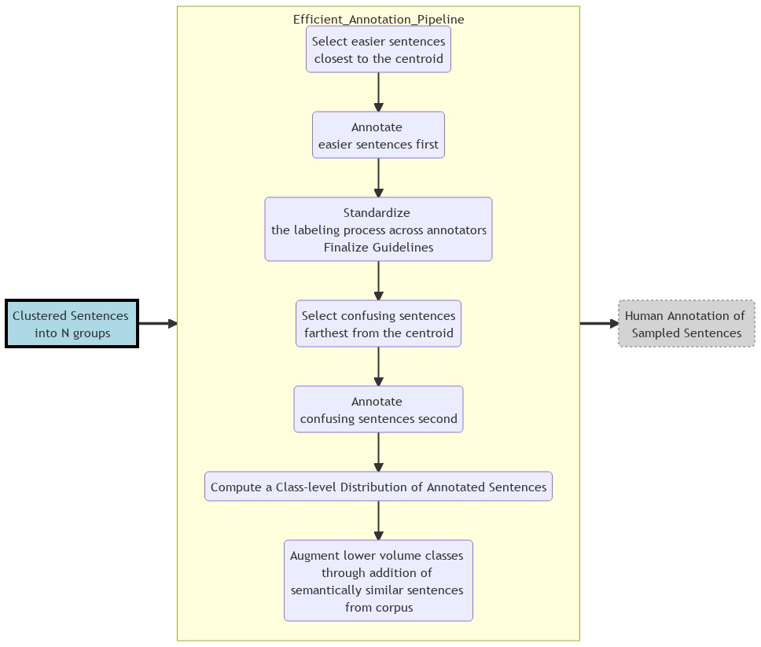

## Aspect-based Sentiment Analysis

### Project Summary

- Built a reusable Sequence Classification ML Pipeline which converts customer comments into trackable `Aspect` and `Sentiment` pairs
- Highlights:
    - ML Pipeline used BERT-fine-tuning  
    - ML Pipeline had easy to use human-in-the-loop annotation scripts that can 
        - do efficient clustering of yet-to-be labeled data and
        - augment low volume classes after initial round of annotations
    - The Pipeline helped yeilding 85%+ F1 score with minimal annotated data for more than 25+ classes
    - There were also scripts to `monitor` performance of model 
- Built a comprehensive Docker image that hosted the DL models as well as Spark-on-Docker preprocessing. 

### I/P and O/P

- **Example I/P**:
     > "The representative  who initially spoke with was very understanding but the dealer whom I was transferred to later was rude and unhelpful"
- **Example O/P**:  
  Part 1:  
     > "The representative who initially spoke with was very understanding"  
     > `Contact_Center_Agent` | `Positive`  
 
  Part 2:  
     > "but the dealer whom I was transferred to later was rude and unhelpful"  
     > `Dealer` | `Negative`

### Business/Technical Benefits

- The codebase was used to build *30+ different Text Classification Models*
    - using the same ML pipeline/framework where each model had 20-30 classes to predict 
- Our repo's framework and models warranted far less human annotated data (than using a typical ML model)
- This was possible because both **Feature Extraction** :snowflake: (for clustering) and **Fine-tuning** :fire:

### Technology Stack

         
 
### Detailed Pipeline

 

  

*Text2Embedding Sub-pipeline

 
  

  

  
   
   

*Efficient Annotation Sub-pipeline

 
  
 
  

