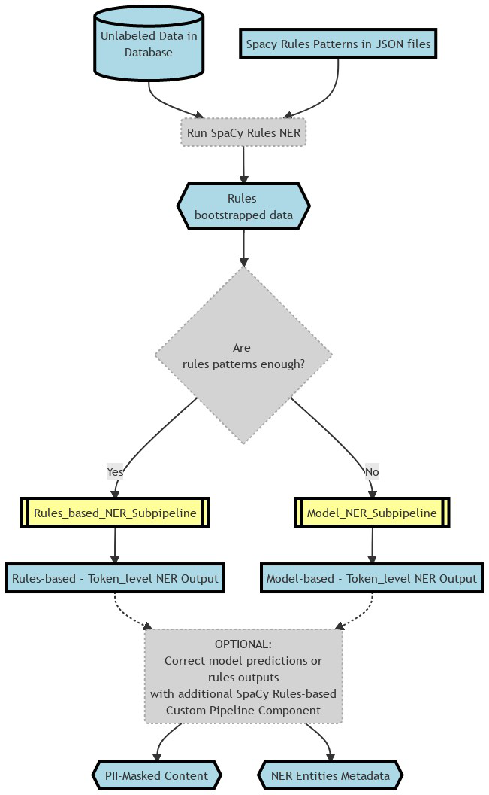
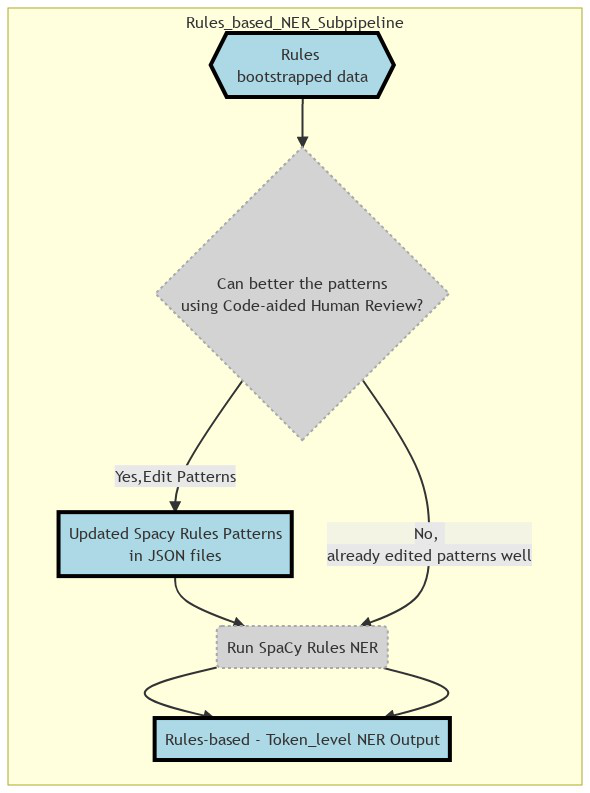

## Personally Identifiable Information (PII) Detection using Named Entity Recognition (NER)

### Project Summary

- Goal: To replace PII in text data
    - by building a **NER** system that can detect PII in text comments and
    - can result in less restricted use of the data
- Annonymized PII in text data
    - by building a NER system using both **RoBerta Fine-tuned Transformer model** and Rules-based logic
- Bootstrapped the training data using Spacy rules (thus easing the annotation process by not starting labeling from scratch) 
- Achieved an F1 score of 89% for detecting the PII entities
- Deployed an asynchronous* Inference REST API (using FastAPI and K8s) that can be plugged into multiple applications

### I/P and O/P

- **Example I/P**:
     > "Please drop my 2019 Focus after service to 2109 Hershell Hollow Road, Nashville, Tennesse. You can reach me at +1 854-789-1234 or gary_kirsten1978@gmail.com - Gary Kirsten" ( a made-up example)
- **Example O/P**:   
     > Please drop my `{{MODEL_YEAR}}` `{{NAMEPLATE}}` after service to `{{ADDRESS}}`. You can reach me at `{{PHONE_NUMBER}}` or `{{EMAIL}}` - `{{PERSON_NAME}}`

### Business/Technical Benefits

- PII Annonymization can aid in less restricted use of the data
- Spacy's Roberta-base Model circumvented the truncation restriction of the transformers max sequence length problem. Refer [Link](https://spacy.io/api/transformer#span_getters)

### Technology Stack

      

### Detailed Pipeline

 
 
   

 Rules-based NER Sub-pipeline

 
  

  

  

 Model-based NER Sub-pipeline

 
  

  

  
  

