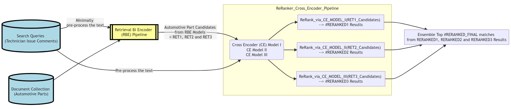
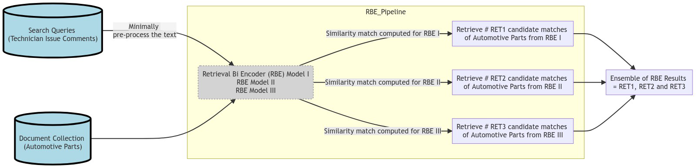

### An NLP Semantic Search Pipeline
(inspired by the workings of a NLP QA system but for Semantic Search) 

### Project Summary

- Goal: To create "digital threads" for connecting automotive data sources
	- which has technician comments about issues before the launch of a vehicle,
	- by assigning semantically matching common part categories to every issue in both data sources 
    
- Business Context
	- The data sources contain technician comments about issues in a vehicle development before the final launch of a vehicle. 
	- The connection is established through NLP techniques (like semantic search, NER) where the right parts are attributed to each issue. 
	- Parts attribution acts a common language - the thread - joining two or more data sources. 
	- The creation of a digital thread helps in prioritizing issues that might delay launch by predicting its prevalence in downstream databases.
	- Every unsolved issues closer to the launch can impact hugely on delivery timelines

### Technology Stack
 
 
 
 
 
 
 
  
 

### Detailed Pipeline

- Inspired by the above Retriever - Reader pipeline but strengthened it by ensembling results of 3 pairs of Retriever-Reader models wherein
    - the `Retriever` narrows down the search space and
    - the `Reader` zeros in on the right results

- Ensemble of 3 `Retriever-Reader` Models

 Retriever Bi Encoder (RBE) pipeline

